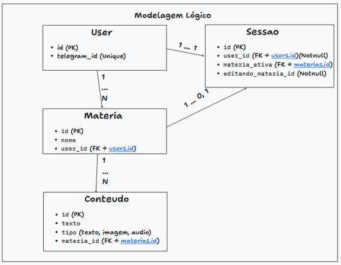

# 📚 Aquinoz Bot

## 📌 Descrição do Projeto

O Aquinoz Bot é uma aplicação voltada para auxiliar nos estudos de forma simples, acessível e eficiente, especialmente para pessoas com acesso limitado à internet.

A proposta do projeto é permitir que o usuário envie conteúdos (como textos, PDFs, imagens e links) e receba de volta:

- Resumos automáticos  
- Questões de múltipla escolha  
- Respostas para dúvidas  
- Organização de conteúdos por matéria  

Tudo isso através de uma interface leve (bot), reduzindo a necessidade de navegação em sites pesados ou plataformas complexas.

---

## 🚨 Problema que o projeto resolve

Muitas plataformas educacionais:
- exigem internet estável  
- são pesadas e difíceis de usar  
- não são acessíveis em contextos de baixa conectividade  

O Aquinoz Bot resolve isso oferecendo:
- interação simples (via bot)  
- processamento automático de conteúdo  
- baixo consumo de dados (algumas operadoras de telecomunicações oferecem acesso ilimitado ao telegram)

---

## 🧰 Tecnologias Utilizadas

### Backend
- Flask — Framework leve para criação da API e integração com o bot  
- Python — Linguagem principal  

### Banco de Dados
- SQLite — Banco local leve e de fácil configuração  

### Processamento de Conteúdo
- OCR (Tesseract) — extração de texto de imagens  
- Manipulação de PDF  
- IA para geração de:
  - resumos  
  - questões  
  - respostas  

### Integrações
- API do Telegram (bot)

---

## ⚙️ Versões sugeridas

| Tecnologia | Versão recomendada |
|----------|------------------|
| Python | 3.10+ |
| Flask | 2.x |
| SQLite | 3.x |
| Tesseract OCR | 5.x |

---

## 🧠 Abordagens e Metodologias

O projeto segue uma abordagem modular, com separação de responsabilidades:

- Controllers / Handlers → recebem mensagens do usuário  
- Services → regras de negócio (resumo, perguntas, etc.)  
- Tasks → processamento mais pesado (PDF, OCR, IA)  
- Models → estrutura do banco de dados
- core → funcionalidades centrais do sistema (ex: autenticação)
- utils → funções reutilizáveis e utilitárias para suporte geral  

### Padrões utilizados:
- Separação em camadas (inspirado em Clean Architecture)  
- Processamento assíncrono com threads  
- Organização por domínio (conteúdo, estudo, ingestão)  

---

## ▶️ Como Executar o Projeto

### 1. Clonar o repositório
```bash
git clone <url-do-repositorio>
cd aquinoz-bot
```

### 2. Criar ambiente virtual
```bash
python -m venv venv
```

### 3. Ativar ambiente virtual

Windows:
```bash
venv\Scripts\activate
```

Linux/Mac:
```bash
source venv/bin/activate
```

### 4. Instalar dependências
```bash
pip install flask sqlalchemy requests python-dotenv pytesseract pillow
```

### 5. Configurar variáveis
Crie um arquivo `.env` com:
```
TOKEN_TELEGRAM=seu_token_aqui
BASE_URL=url_do_ngrok_ou_servidor
```

### 6. Rodar o projeto
```bash
python app.py
```

### 7. Expor localmente (opcional - webhook)
```bash
ngrok http 5000
```

---

## 🗄️ Diagrama do Modelo Lógico do Banco

### Entidades principais:



## 🎯 Objetivo Final

Fornecer uma ferramenta de estudo leve, acessível e inteligente, funcional mesmo em ambientes com pouca conectividade.